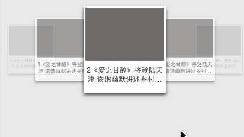

# @mfelibs/carousel

3D旋转木马，支持移动端


## run

```bash
npm run dev
```

## build
```javascript
npm run build
```

## call
```javascript
const config = {
    boxDom : $("#carouselBox"),   //动画父容器
    animationDom : $(".carousel"), //动画容器
    itemClass : 'carousel-item',   //动画子容器类名
    duration: 100, // ms
    animation :'ease', //滚动动画类型
    hasSkew : false //是否重力感应
}
carousel.init(config);
```
## style
Uniform
<br />

<br />
ease
<br />

